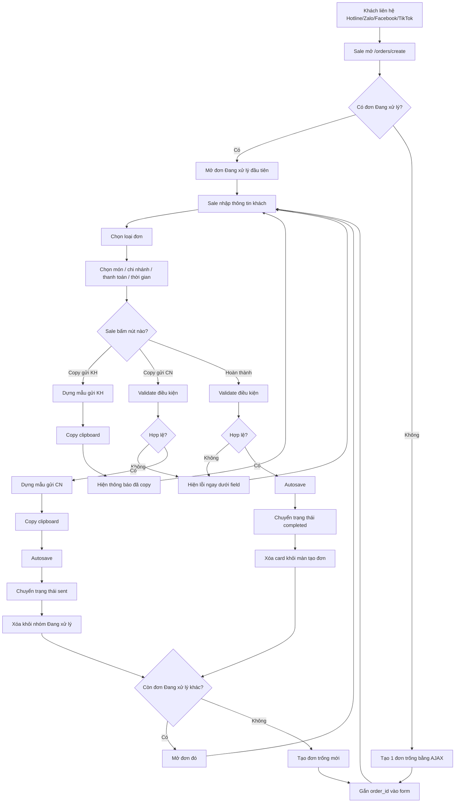
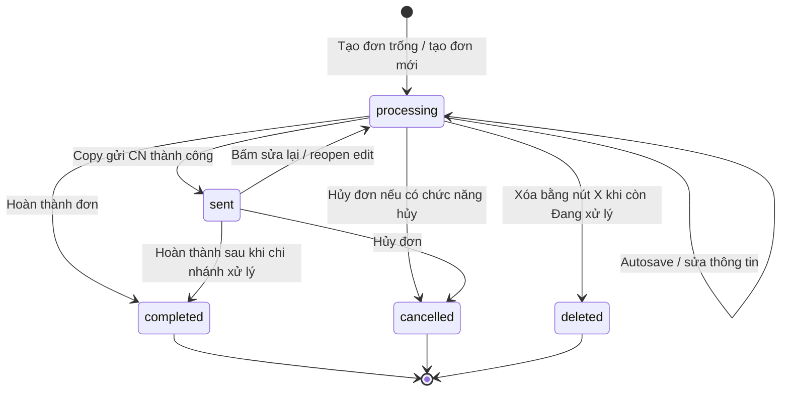
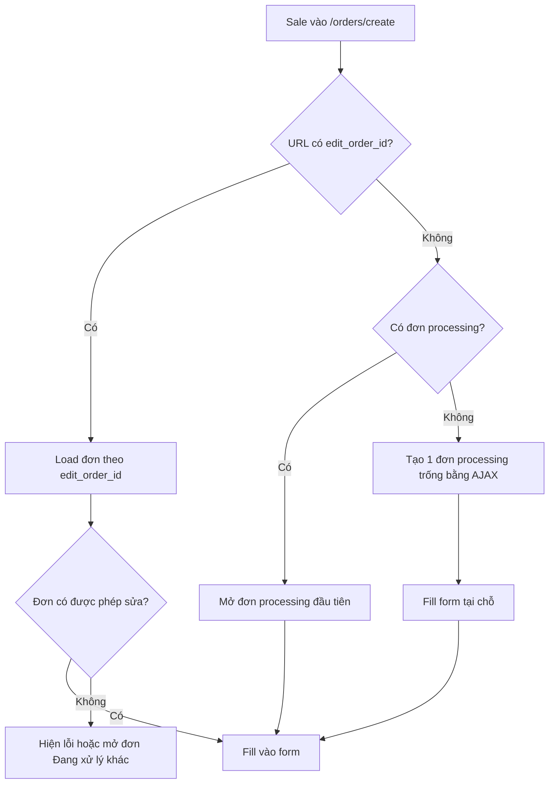
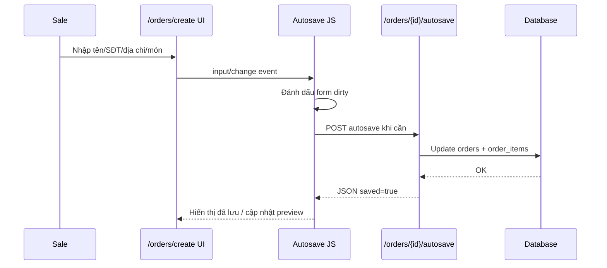
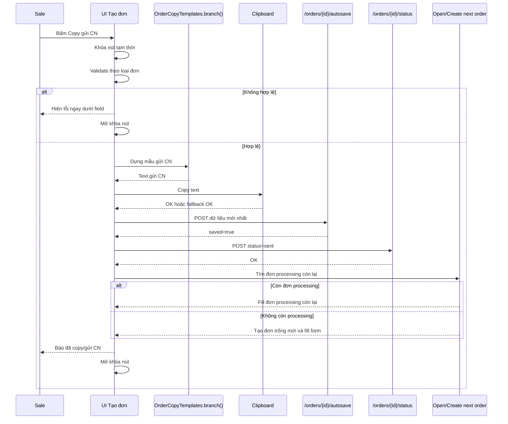
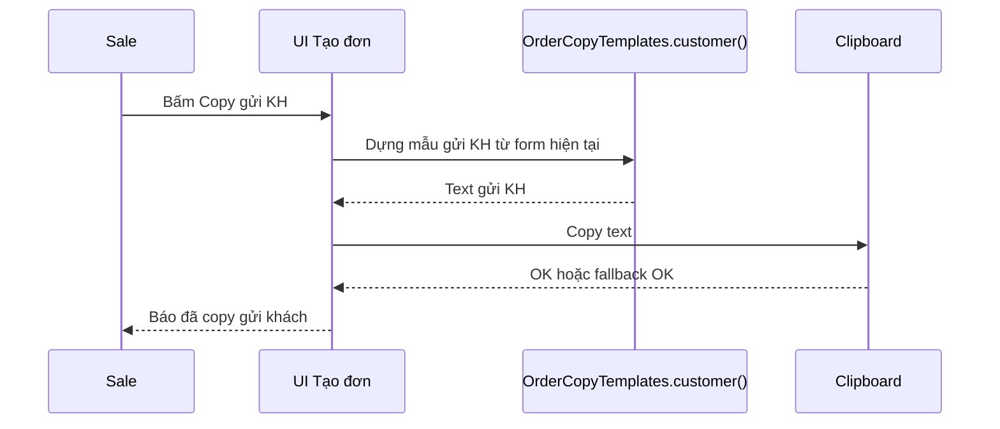
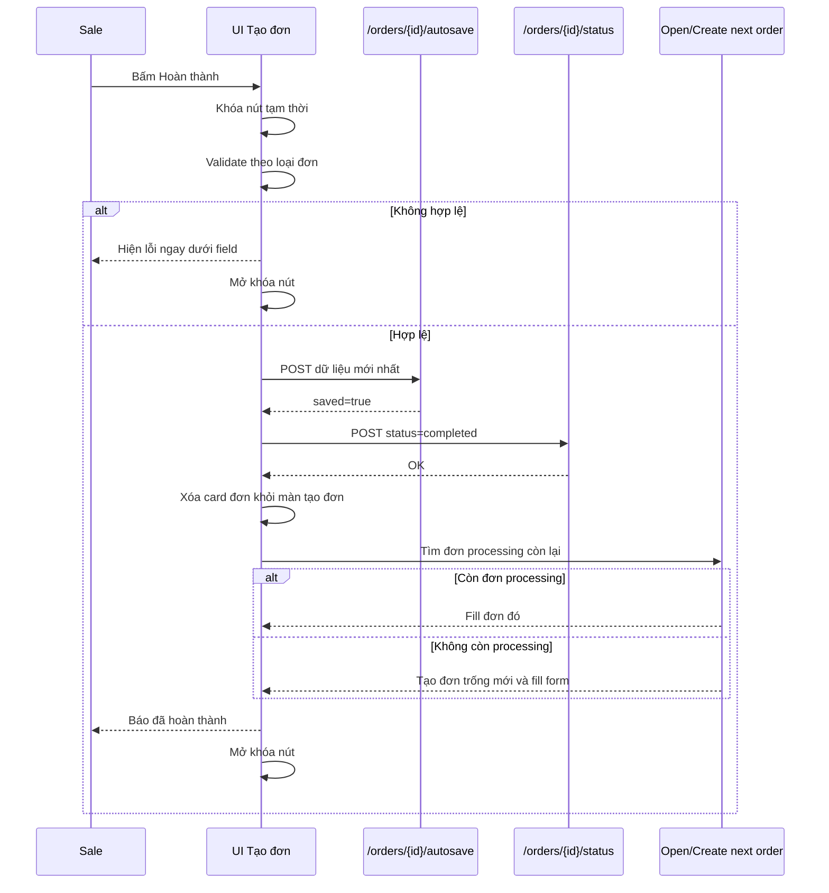
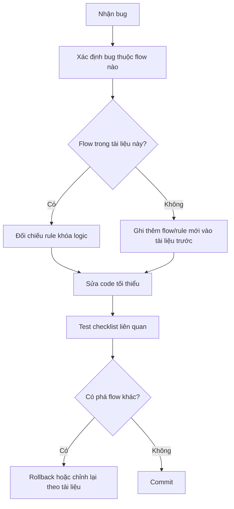

# Đặc tả luồng vận hành tạo đơn PKD ĐMG

> File này là tài liệu khóa logic cho màn tạo đơn và quy trình xử lý đơn. Khi sửa code liên quan đến `/orders/create`, copy gửi CN/KH, autosave, trạng thái đơn hoặc mẫu copy, dev phải đối chiếu file này trước khi sửa.

---

## 1. Mục tiêu của tài liệu

Web đang có nhiều logic phụ thuộc lẫn nhau: tạo đơn, autosave, copy gửi chi nhánh, copy gửi khách, hoàn thành, xóa đơn đang xử lý, mở đơn tiếp theo, template copy và phân quyền. Nếu sửa một phần mà không nhìn toàn bộ quy trình thì rất dễ phát sinh lỗi cũ quay lại.

Tài liệu này dùng để:

1. Vẽ lại luồng vận hành một cách trực quan.
2. Làm chuẩn nghiệp vụ cho sale/admin/dev.
3. Khóa các rule quan trọng để tránh update làm hỏng logic cũ.
4. Làm checklist test trước khi merge hoặc deploy.
5. Làm tài liệu tham chiếu cho Codex/dev khi sửa lỗi.

---

## 2. Nguyên tắc khóa logic

Những nguyên tắc dưới đây là **bắt buộc giữ** khi sửa code.

### 2.1. Không reload không cần thiết ở màn tạo đơn

Màn `/orders/create` là màn sale thao tác tốc độ cao. Các thao tác sau không được làm reload/trả người dùng qua trang khác nếu không có yêu cầu rõ ràng:

- Tự tạo đơn trống.
- Mở đơn đang xử lý.
- Copy gửi CN.
- Copy gửi KH.
- Hoàn thành đơn.
- Xóa đơn đang xử lý.
- Chuyển sang đơn đang xử lý tiếp theo.

### 2.2. Form đang nhập luôn phải có `order_id`

Không cho sale nhập thông tin vào một form không gắn với đơn thật.

Rule:

```text
Nếu vào /orders/create mà không có đơn Đang xử lý
→ hệ thống tự tạo 1 đơn trống
→ gắn order_id vào form
→ sale nhập trực tiếp trên đơn đó
```

Không được để tình trạng:

```text
Sale nhập thông tin
→ bấm Copy gửi CN
→ lỗi vì chưa có order_id
```

### 2.3. Chỉ tạo đơn mới khi thật sự hết đơn đang xử lý

Sau khi gửi CN/hoàn thành/xóa đơn:

```text
Nếu còn đơn Đang xử lý khác
→ mở đơn đó lên làm tiếp
Nếu không còn đơn Đang xử lý nào
→ mới tạo 1 đơn trống mới
```

Không được tạo đơn trống mới sau mỗi lần gửi CN nếu vẫn còn đơn đang xử lý khác.

### 2.4. Copy gửi KH không đổi trạng thái đơn

Nút **Copy gửi KH** chỉ copy nội dung gửi khách hàng.

Không được:

- Chuyển trạng thái đơn.
- Tự hoàn thành đơn.
- Xóa card đơn.
- Mở đơn mới.

### 2.5. Copy gửi CN mới đổi trạng thái sang `sent`

Nút **Copy gửi CN** sau khi đủ điều kiện sẽ:

```text
Validate
→ dựng mẫu gửi CN
→ copy clipboard
→ autosave đơn
→ chuyển trạng thái sent / Đã gửi CN
→ đưa đơn ra khỏi danh sách Đang xử lý trên màn tạo đơn
→ mở đơn Đang xử lý còn lại hoặc tạo đơn mới nếu hết
```

### 2.6. Hoàn thành đơn không được nhảy trang tổng quan

Nút **Hoàn thành** ở màn tạo đơn phải xử lý tại chỗ:

```text
Validate
→ autosave
→ chuyển trạng thái completed
→ xóa card khỏi màn tạo đơn
→ mở đơn Đang xử lý còn lại hoặc tạo đơn trống mới nếu hết
```

Không được chuyển sang `/`, `/orders` hoặc bất kỳ trang tổng quan nào.

### 2.7. Mẫu copy không được rải rác nhiều nơi

Mẫu gửi CN/KH phải đi qua module dựng template tập trung.

Không được hard-code mẫu copy ở nhiều file khác nhau vì dễ gây lỗi:

```text
Sửa flow tạo đơn → vô tình phá mẫu gửi CN/KH
```

Nguồn mẫu hiện tại:

```text
/settings/system
→ Mẫu copy đơn hàng
```

Frontend nên lấy qua module:

```js
window.OrderCopyTemplates = {
  branch,
  customer,
  updatePreview,
  money
}
```

---

## 3. Khái niệm nghiệp vụ

### 3.1. Loại đơn

| Giá trị | Tên hiển thị | Ý nghĩa |
|---|---|---|
| `delivery` | Đơn mang về | Đơn giao/ship cho khách |
| `pickup` | Đơn ghé lấy | Khách tự ghé chi nhánh lấy đơn |
| `booking` | Đơn đặt bàn | Khách đặt bàn tại chi nhánh |

### 3.2. Trạng thái đơn chính

| Giá trị | Tên hiển thị | Ý nghĩa | Có hiện ở màn tạo đơn? |
|---|---|---|---|
| `processing` | Đang xử lý | Sale đang nhập/làm đơn | Có |
| `sent` | Đã gửi CN | Đã copy/gửi cho chi nhánh | Có thể hiện dạng card đã gửi, nhưng không phải đơn đang xử lý |
| `completed` | Hoàn thành | Đơn đã chốt/hoàn tất | Không |
| `cancelled` | Đã hủy | Đơn hủy | Không |

### 3.3. Vai trò người dùng

| Vai trò | Quyền chính |
|---|---|
| `staff` | Tạo và xử lý đơn của chính mình |
| `admin` | Xem/quản lý toàn bộ đơn, nhân viên, settings, menu, chi nhánh |

---

## 4. Sơ đồ tổng quan quy trình vận hành



---

## 5. State machine của đơn hàng



### Rule khóa state

| Từ trạng thái | Đến trạng thái | Cho phép? | Ghi chú |
|---|---:|---|---|
| `processing` → `processing` | Có | Autosave/sửa form |
| `processing` → `sent` | Có | Chỉ khi Copy gửi CN hợp lệ |
| `processing` → `completed` | Có | Chỉ khi Hoàn thành hợp lệ |
| `processing` → `deleted` | Có | Nút X, chỉ xóa đơn đang xử lý |
| `sent` → `processing` | Có | Khi cần sửa lại đơn đã gửi CN |
| `sent` → `completed` | Có | Khi đơn đã hoàn tất |
| `completed` → `processing` | Không mặc định | Tránh sửa đơn đã chốt nếu chưa có nghiệp vụ rõ |
| `deleted` → trạng thái khác | Không | Đã xóa thì không khôi phục trong flow hiện tại |

---

## 6. Quy trình vào màn tạo đơn

### 6.1. Mục tiêu

Khi sale mở `/orders/create`, web phải đưa sale vào trạng thái có thể nhập đơn ngay.

### 6.2. Flow chuẩn



### 6.3. Điều kiện đúng

- Không nhảy sang endpoint JSON.
- Không hiện màn JSON thô.
- Không reload nhiều lần.
- Không tạo nhiều đơn trống liên tục.
- Không để form trống mà không có `order_id`.

---

## 7. Quy trình nhập và autosave

### 7.1. Mục tiêu

Sale có thể nhập nhanh, chuyển qua lại đơn đang xử lý mà không mất thông tin.

### 7.2. Flow autosave



### 7.3. Rule khóa autosave

- Autosave chỉ nên cập nhật đơn đang `processing`.
- Không để payload cache cũ ghi đè dữ liệu vừa nhập.
- Khi chuyển đơn, nếu form dirty thì phải autosave hoặc bảo toàn dữ liệu trước khi fill đơn khác.
- Khi API lỗi phải báo rõ, không im lặng.

---

## 8. Quy trình Copy gửi CN

### 8.1. Mục tiêu

Copy gửi CN là hành động gửi đơn cho chi nhánh. Đây là hành động có đổi trạng thái.

### 8.2. Flow chi tiết



### 8.3. Điều kiện bắt buộc

Copy gửi CN chỉ chạy khi:

- Có `order_id` hợp lệ.
- Loại đơn hợp lệ.
- Đủ field bắt buộc theo loại đơn.
- Có ít nhất 1 món với đơn `delivery` và `pickup`.
- Clipboard copy thành công hoặc fallback thành công.

### 8.4. Không được làm

- Không submit form thường gây reload.
- Không chuyển sang trang tổng quan.
- Không tạo đơn mới nếu còn đơn `processing` khác.
- Không dùng mẫu gửi KH để gửi CN.
- Không copy text stale từ preview cũ nếu form vừa sửa.

---

## 9. Quy trình Copy gửi KH

### 9.1. Mục tiêu

Copy gửi KH chỉ để sale gửi xác nhận cho khách. Hành động này **không đổi trạng thái đơn**.

### 9.2. Flow chi tiết



### 9.3. Rule khóa

- Không đổi trạng thái đơn.
- Không autosave bắt buộc nếu chỉ copy KH, trừ khi sau này nghiệp vụ yêu cầu rõ.
- Không xóa card.
- Không mở đơn mới.
- Không dùng mẫu gửi CN.

---

## 10. Quy trình Hoàn thành đơn

### 10.1. Mục tiêu

Hoàn thành đơn là kết thúc xử lý đơn hiện tại ngay trên màn tạo đơn, không điều hướng qua trang khác.

### 10.2. Flow chi tiết



### 10.3. Rule khóa

- Không điều hướng sang `/`, `/orders` hoặc dashboard.
- Không reload toàn trang.
- Không tạo đơn trống mới nếu còn đơn đang xử lý khác.
- Sau khi completed, đơn không còn nằm trong nhóm `processing`.

---

## 11. Quy trình xóa đơn đang xử lý bằng nút X

### 11.1. Mục tiêu

Nút **X** dùng để xóa đơn trống/đơn nhập nhầm tương tự logic nháp cũ.

### 11.2. Rule phân quyền

| Người dùng | Được xóa đơn processing? | Ghi chú |
|---|---|---|
| Staff | Có, nếu là đơn của chính mình | Không được xóa đơn người khác |
| Admin | Có | Dùng cho quản trị |

### 11.3. Rule trạng thái

Chỉ được xóa đơn có trạng thái:

```text
processing
```

Không được xóa bằng route này nếu đơn đã:

```text
sent
completed
cancelled
```

### 11.4. Flow

```mermaid
flowchart TD
    A[Sale bấm X trên card Đang xử lý] --> B[Xác nhận xóa?]
    B -- Không --> C[Giữ nguyên]
    B -- Có --> D[POST /orders/{id}/delete-processing]
    D --> E{API OK?}
    E -- Không --> F[Hiện lỗi]
    E -- Có --> G[Xóa card khỏi màn tạo đơn]
    G --> H{Còn đơn processing khác?}
    H -- Có --> I[Mở đơn đó]
    H -- Không --> J[Tạo đơn trống mới]
```

---

## 12. Bảng validate theo loại đơn

| Field | Mang về `delivery` | Ghé lấy `pickup` | Đặt bàn `booking` | Ghi chú |
|---|---:|---:|---:|---|
| Tên khách | Bắt buộc | Bắt buộc | Bắt buộc | `customer_name` |
| SĐT | Bắt buộc 10 số | Không bắt buộc | Nên có, không bắt buộc nếu chưa chốt | Rule hiện tại pickup không bắt buộc SĐT |
| Địa chỉ | Bắt buộc | Không cần | Không cần | Chỉ delivery |
| Chi nhánh | Nên có hoặc bắt buộc theo setup | Bắt buộc | Bắt buộc | Để biết CN xử lý |
| Món | Bắt buộc ít nhất 1 món | Bắt buộc ít nhất 1 món | Không bắt buộc | Booking có thể chỉ đặt bàn |
| Số khách | Không cần | Không cần | Bắt buộc | `guest_count` |
| Thời gian nhận | Nếu trống mặc định Giao ngay | Nên có | Bắt buộc | `receive_time` |
| Thanh toán | Nên có | Nên có | Không bắt buộc | Dùng cho mẫu gửi KH |

### Rule hiển thị lỗi

- Lỗi phải hiện ngay dưới field liên quan.
- Không chỉ hiện toast ở góc màn hình.
- Không cho chạy Copy gửi CN/Hoàn thành khi thiếu field bắt buộc.
- Lỗi chọn món nên hiện ở khu menu/cart, không hiện chung chung.

---

## 13. Mẫu copy gửi CN/KH

### 13.1. Nguồn cấu hình

Admin sửa mẫu tại:

```text
/settings/system
→ Mẫu copy đơn hàng
```

Có 6 mẫu:

| Loại đơn | Gửi CN | Gửi KH |
|---|---|---|
| Đơn mang về | `copy_template_delivery_branch` | `copy_template_delivery_customer` |
| Đơn ghé lấy | `copy_template_pickup_branch` | `copy_template_pickup_customer` |
| Đơn đặt bàn | `copy_template_booking_branch` | `copy_template_booking_customer` |

### 13.2. Biến template

| Biến | Ý nghĩa | Ví dụ |
|---|---|---|
| `{customer_name}` | Tên khách | Nguyễn Văn A |
| `{phone}` | Số điện thoại | 0901234567 |
| `{address}` | Địa chỉ giao | 12 Nguyễn Huệ, Q1 |
| `{branch}` | Chi nhánh | CN Thủ Đức |
| `{items}` | Danh sách món | `  1 Lẩu nhỏ` |
| `{total_line}` | Dòng tổng tiền/tổng bill | `=> Tổng tiền: 199.000đ` |
| `{total}` | Chỉ giá trị tổng tiền | `199.000đ` |
| `{delivery_time}` | Thời gian giao | Giao ngay |
| `{pickup_time}` | Thời gian ghé lấy | 18:30 |
| `{receive_time}` | Thời gian nhận chung | Giao ngay / 18:30 |
| `{payment}` | Hình thức thanh toán | Chuyển khoản |
| `{branch_footer}` | Lưu ý + tag @ | `⚠ Lưu ý...` |
| `{guest_count}` | Số khách | 4 |
| `{note}` | Ghi chú | Ít cay |

### 13.3. Rule tên món

| Đối tượng copy | Tên món ưu tiên |
|---|---|
| Gửi CN | `branch_name` |
| Gửi KH | `customer_name` |

Nếu field riêng bị trống thì fallback về tên món chính.

### 13.4. Rule giá và tổng tiền

| Tùy chọn | Mặc định | Ý nghĩa |
|---|---:|---|
| Gửi CN hiện giá sau từng món | Tắt | CN thường chỉ cần tên viết tắt |
| Gửi CN hiện tổng tiền | Bật | Giúp CN nắm tổng bill nếu cần |
| Gửi KH hiện giá sau từng món | Bật | Khách cần xem chi tiết bill |
| Gửi KH hiện tổng bill | Bật | Xác nhận tổng tiền |

---

## 14. API/AJAX contract của màn tạo đơn

### 14.1. `/orders/new-processing-json`

Mục đích: tạo một đơn `processing` trống để sale nhập.

Yêu cầu:

- Trả JSON.
- Không render HTML.
- Không redirect.
- Không để người dùng nhìn thấy JSON thô.

Kết quả mong muốn:

```json
{
  "order": {
    "id": 123,
    "code": "...",
    "status": "processing"
  }
}
```

### 14.2. `/orders/{id}/edit-data`

Mục đích: lấy dữ liệu đơn để fill vào form.

Yêu cầu:

- Trả đầy đủ thông tin order, items, generated_text, total.
- Chỉ cho user có quyền xem/sửa.
- Dùng để mở đơn trong form mà không reload trang.

### 14.3. `/orders/{id}/autosave`

Mục đích: lưu dữ liệu đang nhập.

Yêu cầu:

- Chỉ autosave đơn `processing`.
- Trả JSON `saved=true` khi thành công.
- Không redirect.

### 14.4. `/orders/{id}/status`

Mục đích: đổi trạng thái đơn.

Yêu cầu cho flow nhanh:

- JS gọi bằng `fetch`.
- Không được để redirect HTML làm trình duyệt tải ngầm nguyên trang gây lag.
- Nếu backend còn redirect cho form thường, frontend phải dùng `redirect: 'manual'` hoặc backend nên hỗ trợ JSON khi request AJAX.

### 14.5. `/orders/{id}/delete-processing`

Mục đích: xóa đơn đang xử lý.

Yêu cầu:

- Chỉ xóa đơn `processing`.
- Staff chỉ xóa đơn của mình.
- Admin xóa được theo quyền admin.
- Trả JSON cho AJAX.

---

## 15. Trách nhiệm từng file JS chính

| File | Trách nhiệm | Không nên làm |
|---|---|---|
| `order-create-flow.js` | Điều phối flow tạo/mở/xóa/đóng đơn, xử lý nút nhanh | Không hard-code mẫu copy |
| `order-open-orders.js` | Mở card đơn vào form, cache payload, fill form mượt | Không đổi nghiệp vụ trạng thái |
| `order-cache-guard.js` | Validate, guard cache/dirty form, chặn lỗi reload/copy cũ | Không tự dựng mẫu copy riêng rẽ |
| `order-edit-mode.js` | Hỗ trợ chế độ sửa/copy nếu còn dùng | Không tranh handler với flow chính |
| `menu-card-click.js` | Click món, module `OrderCopyTemplates` | Không đổi trạng thái đơn |

### Rule tránh xung đột JS

- Một nút chỉ nên có một handler chính chịu trách nhiệm.
- Handler cũ nếu còn tồn tại phải được chặn hoặc bỏ để tránh double-submit.
- Khi đang xử lý request, nút phải khóa tạm thời.
- Sau khi xong request, phải mở khóa hoặc chuyển sang đơn khác.

---

## 16. Checklist test bắt buộc trước khi merge/deploy

### 16.1. Vào màn tạo đơn

```text
[ ] Vào /orders/create khi không có đơn processing → tự tạo đúng 1 đơn trống
[ ] Không nhảy sang /orders/new-processing-json
[ ] Không hiện JSON thô
[ ] Vào /orders/create khi có đơn processing → mở đơn đó
[ ] Reload trang không tạo thêm nhiều đơn rác liên tục
```

### 16.2. Nhập đơn và autosave

```text
[ ] Nhập tên khách rồi chuyển card khác → không mất tên
[ ] Nhập địa chỉ rồi chuyển card khác → không mất địa chỉ
[ ] Chọn món rồi chuyển card khác → không mất món
[ ] Ghi chú món vẫn giữ đúng
[ ] Preview gửi CN cập nhật theo dữ liệu mới
```

### 16.3. Copy gửi CN

```text
[ ] Thiếu tên → báo lỗi dưới field tên
[ ] Thiếu SĐT delivery → báo lỗi dưới field SĐT
[ ] SĐT không đủ 10 số delivery → báo lỗi
[ ] Thiếu địa chỉ delivery → báo lỗi dưới field địa chỉ
[ ] Chưa chọn món delivery/pickup → báo lỗi khu món/cart
[ ] Đủ điều kiện → copy được
[ ] Sau copy → trạng thái thành Đã gửi CN
[ ] Nếu còn đơn processing khác → mở đơn đó, không tạo đơn mới
[ ] Nếu không còn processing → tạo đúng 1 đơn trống mới
[ ] Không reload trang
```

### 16.4. Copy gửi KH

```text
[ ] Copy gửi KH dùng mẫu KH, không dùng mẫu CN
[ ] Tên món là tên đầy đủ/customer_name
[ ] Giá từng món hiển thị theo setting
[ ] Tổng bill hiển thị theo setting
[ ] Không đổi trạng thái đơn
[ ] Không mở đơn mới
[ ] Không reload trang
```

### 16.5. Hoàn thành

```text
[ ] Thiếu field bắt buộc → báo lỗi đúng chỗ
[ ] Đủ điều kiện → autosave dữ liệu mới nhất
[ ] Chuyển trạng thái completed
[ ] Xóa khỏi màn tạo đơn
[ ] Không nhảy sang dashboard/tổng quan
[ ] Nếu còn processing → mở đơn còn lại
[ ] Nếu hết processing → tạo 1 đơn trống mới
```

### 16.6. Nút X

```text
[ ] Nút X chỉ hiện/hoạt động với đơn processing
[ ] Staff xóa được đơn processing của mình
[ ] Staff không xóa được đơn người khác
[ ] Không xóa được đơn sent/completed bằng route delete-processing
[ ] Xóa đơn cuối cùng → tự tạo đơn trống mới
```

### 16.7. Settings template

```text
[ ] Vào /settings/system thấy Mẫu copy đơn hàng
[ ] Sửa mẫu delivery gửi CN → lưu được
[ ] Vào /orders/create preview gửi CN ăn theo mẫu mới
[ ] Copy gửi KH ăn theo mẫu KH
[ ] Bật/tắt giá từng món có hiệu lực
[ ] Bật/tắt dòng tổng tiền có hiệu lực
[ ] {branch_footer} render đúng lưu ý/tag
```

---

## 17. Quy trình sửa lỗi an toàn

Khi có lỗi logic màn tạo đơn, làm theo thứ tự:



### 17.1. Mẫu ghi bug

```text
Bug:
Màn hình:
User/role:
Loại đơn:
Trạng thái đơn trước khi bấm:
Nút đã bấm:
Kết quả mong muốn:
Kết quả thực tế:
Có reload trang không:
Console có lỗi không:
API nào lỗi:
```

### 17.2. Mẫu ghi thay đổi logic

```text
Thay đổi đề xuất:
Flow bị ảnh hưởng:
Rule trong docs cần cập nhật:
File code cần sửa:
Checklist phải test:
Có ảnh hưởng production không:
```

---

## 18. Những lỗi hay gặp và nguyên nhân

### 18.1. Bấm Copy gửi CN không hoạt động

Nguyên nhân thường gặp:

- Form chưa có `order_id`.
- Handler bị trùng, một handler submit form thường, một handler fetch.
- Clipboard API bị chặn nhưng không có fallback.
- Validate fail nhưng không hiện lỗi rõ.
- Endpoint status redirect HTML làm flow bị chậm/giật.

### 18.2. Mẫu gửi CN/KH bị sai sau khi sửa flow

Nguyên nhân thường gặp:

- Mẫu copy bị hard-code ở nhiều file.
- Preview đang lấy text backend cũ, copy lại lấy text frontend mới.
- Handler copy KH vẫn chạy code cũ.
- Không gọi `OrderCopyTemplates.updatePreview()` trước khi copy.

### 18.3. Tạo đơn bị giật/nhảy JSON

Nguyên nhân thường gặp:

- Form tạo đơn mới submit thẳng tới `/orders/new-processing-json`.
- JS chưa chặn submit kịp.
- Endpoint JSON bị mở trực tiếp bằng navigation.

Rule xử lý:

- Tạo đơn mới phải gọi bằng `fetch`.
- Sau khi tạo có thể fill form tại chỗ hoặc update URL nhẹ bằng history API, không để trình duyệt mở JSON.

### 18.4. Hoàn thành đơn nhảy sang tổng quan

Nguyên nhân thường gặp:

- Button submit form thường.
- Backend redirect sau status update.
- Handler JS không chặn event đủ sớm.

Rule xử lý:

- Hoàn thành ở màn tạo đơn phải là AJAX flow.
- Không redirect người dùng khỏi `/orders/create`.

---

## 19. Đề xuất khóa logic bằng code ở bước sau

Tài liệu này là bước 1. Để khóa logic cứng hơn trong code, nên làm tiếp các bước sau:

1. Tạo service/backend riêng cho state transition, ví dụ `OrderStateService`.
2. Tạo enum/hằng số trạng thái đơn, tránh dùng string rải rác.
3. Tạo một module JS duy nhất điều phối action buttons.
4. Tạo test case tối thiểu cho:
   - Render template.
   - Validate theo loại đơn.
   - Chuyển trạng thái hợp lệ/không hợp lệ.
5. Tách hẳn template copy khỏi file click món nếu cần.
6. Thêm preview template trong admin `/settings/system`.

---

## 20. Kết luận

Mọi thay đổi liên quan đến màn tạo đơn cần giữ 5 nguyên tắc lõi:

```text
1. Không reload khi sale thao tác nhanh.
2. Form đang nhập luôn có order_id.
3. Chỉ tạo đơn mới khi hết đơn đang xử lý.
4. Copy gửi KH không đổi trạng thái.
5. Copy gửi CN / Hoàn thành phải mở tiếp đơn processing còn lại hoặc tạo 1 đơn trống mới.
```

Nếu sửa code mà vi phạm 1 trong 5 nguyên tắc trên thì xem như phá flow vận hành và cần chỉnh lại trước khi merge/deploy.
